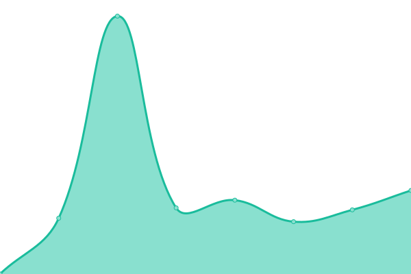

# [📈 Live Status](https://michalpulpan.github.io/upptime-ecobamboo): <!--live status--> **🟩 All systems operational**

This repository contains the open-source uptime monitor and status page for [Michal Půlpán](https://michalpulpan.github.io/upptime-ecobamboo), powered by [Upptime](https://github.com/upptime/upptime).

With [Upptime](https://upptime.js.org), you can get your own unlimited and free uptime monitor and status page, powered entirely by a GitHub repository. We use [Issues](https://github.com/michalpulpan/upptime-ecobamboo/issues) as incident reports, [Actions](https://github.com/michalpulpan/upptime-ecobamboo/actions) as uptime monitors, and [Pages](https://michalpulpan.github.io/upptime-ecobamboo) for the status page.

<!--start: status pages-->
<!-- This summary is generated by Upptime (https://github.com/upptime/upptime) -->
<!-- Do not edit this manually, your changes will be overwritten -->
<!-- prettier-ignore -->
| URL | Status | History | Response Time | Uptime |
| --- | ------ | ------- | ------------- | ------ |
|  [CZ Homepage](https://ecobamboo.cz) | 🟩 Up | [cz-homepage.yml](https://github.com/michalpulpan/upptime-ecobamboo/commits/HEAD/history/cz-homepage.yml) | 

 1840ms
     
 | 

<a href="https://status.ecobm.cz/history/cz-homepage">100.00%</a>
    

|  [SK Homepage](https://ecobamboo.sk) | 🟩 Up | [sk-homepage.yml](https://github.com/michalpulpan/upptime-ecobamboo/commits/HEAD/history/sk-homepage.yml) | 

 2508ms
     
 | 

<a href="https://status.ecobm.cz/history/sk-homepage">100.00%</a>
    

|  [CZ Product page](https://ecobamboo.cz/produkt/07014P-W/ecobamboo-podprsenka-s-vycpavkami-damske) | 🟩 Up | [cz-product-page.yml](https://github.com/michalpulpan/upptime-ecobamboo/commits/HEAD/history/cz-product-page.yml) | 

 2172ms
     
 | 

<a href="https://status.ecobm.cz/history/cz-product-page">100.00%</a>
    

|  [CZ Category](https://ecobamboo.cz/kategorie/4/zeny/kalhotky) | 🟩 Up | [cz-category.yml](https://github.com/michalpulpan/upptime-ecobamboo/commits/HEAD/history/cz-category.yml) | 

 951ms
     
 | 

<a href="https://status.ecobm.cz/history/cz-category">100.00%</a>
    

<!--end: status pages-->

[**Visit our status website →**](https://michalpulpan.github.io/upptime-ecobamboo)

## 📄 License

- Powered by: [Upptime](https://github.com/upptime/upptime)
- Code: [MIT](./LICENSE) © [Anand Chowdhary](https://anandchowdhary.com), supported by [Pabio](https://pabio.com)
- Data in the `./history` directory: [Open Database License](https://opendatacommons.org/licenses/odbl/1-0/)
